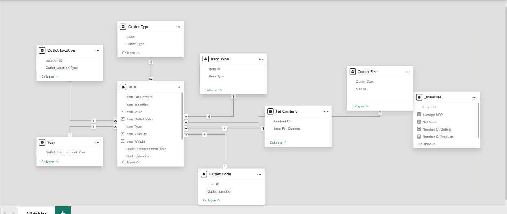

# Stephanie Investment  Business Analysis
## Stephanie is a retail chain business with multiple outlets across the country, generating high-frequency transaction data from various operational processes and customer touchpoints.

## Executive Summary
- Management requires data-driven insights into the overall business performance across all outlets, covering the period from inception to date. 
- Developed an interactive power BI which addresses the major concerns of the management to create different KPI cards  and provide other visuals to break down other findings  using the available dataset which contains over 4650 rows and 12 columns.
- Delivered a centralized, data-driven reporting solution which shows that the business has made a net sales of $10.6M and manages an average MRP of $141.72 
## The Business Problem
Stephanie Investment Management is interested in going beyond raw sales figures by leveraging critical KPIs and visual insights to support data-driven decision-making, enabling sustainable growth and long-term business success.
### Key Questions Addressed:
- How have Key Performance Indicators (KPIs) changed between 1987 till 2009?
- Which product categories are leading?
- Which brands generated the most revenue?
- Which outlet generated more sales?
## The Process (Methodology)
### Tools Used:
Power BI, Power Query, DAX
### Data Sourcing & Overview
The dataset consists of approximately 4650 transactions with 12 columns, covering operations across all current regions.
### Data Cleaning & Transformation (ETL)
Using Power Query, the raw data was transformed to ensure accuracy:
- Removed duplicate entries from the dataset.
- Created a date table
- Removed all the nulls

## Analysis & Insights
This section breaks down the data into actionable stories.
### The KPI Cards
Despite establishing a network of over 5,000 outlets across multiple regions and store formats, the business generated $10.6M in net sales from its portfolio of 16 products. Notably, the average MRP across these products stands at $141.72. 
### Top 5 Net Sales
Snack, Food and Vegetables , Household ,Frozen Foods and Dairy are the top 5 products that contributed more to the net sales . Snacks contributed a total of $1.57M, Food and Vegetables contributed $1.55M, Households contributed $1.19M, Frozen food contributed $1.06M and Dairy contributed $0.89M .
### Bottom 5 Net Sales
Hard drinks, Starchy Food, Others , Breakfast  and Seafood are the bottom 5 products that contributed more to the net sales . Hard drinks contributed a total of $0.26M, Starchy Food contributed $0.22M, Others contributed $0.20M, Breakfast contributed $0.13M and Seafood contributed $0.09M .
### Analysis Of The Established Outlets
The business established more small outlets than medium and high outlets. The number of small outlets is 1860 which is the highest closely followed by medium outlets which has a total of 1858 and the least is high with a total number of 932.
The small outlets generated the highest sales among the three major outlets created by the business. Small outlets generated $4.4M followed by the medium outlets which generated $4M and the high outlets generated $2.1M.
Though the business is growing, the visuals showed vividly that there is a decrease in the number of outlets the business is establishing.
## Recommendations
- ### Double down on high-performing categories 
Snacks, Food & Vegetables, and Household items are your revenue drivers. That’s not just interesting—it’s a signal.
Increase shelf space, improve visibility, and prioritize stock availability for these categories. You can also introduce variants, bundle offers, or slight price optimization to extract more value from what’s already working. 
- ### Fix or rethink underperforming categories 
Hard Drinks, Seafood, and Breakfast aren’t pulling their weight. Don’t just accept that—investigate why.
Is it pricing, poor demand, bad placement, or supply issues?
If margins are low and demand is weak, consider reducing SKU count or replacing them with more profitable alternatives. If demand exists but visibility is poor, reposition them in-store. 
- ### Leverage the strength of small outlets 
Small outlets are doing two things right: they’re the most in number and they generate the highest revenue. That’s a strong model.
Standardize what makes them successful—location strategy, product mix, or operational efficiency—and replicate it in future expansions. 
- ### Optimize medium and large outlet performance 
Medium outlets are almost equal in number to small ones but underperform slightly. That gap is an opportunity.
Review their product mix and customer behavior—are they overstocked with low-performing items? Are they missing top-selling categories?
Large outlets, despite their size, are generating the least relative value. That’s a red flag. They may be inefficient, poorly located, or carrying the wrong assortment. 
- ### Improve category distribution across outlet types 
Ensure that top-selling categories (like Snacks and Food & Vegetables) are consistently available across all outlet sizes.
Some underperformance might simply be due to poor assortment alignment rather than lack of demand.
- ## Link
[Interactive Power BI Link](https://app.powerbi.com/view?r=eyJrIjoiZjNhNjg3NzAtOWQwYi00OWI5LTljMjEtMThkOWIzODEzMTc1IiwidCI6IjY0M2NkODIwLWU2YzYtNGI2ZC05ZDc5LTJjOTgwOTllMTg3MCJ9)

