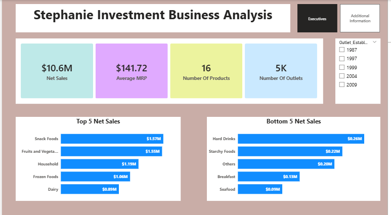

# Stephanie Investment  Business Analysis
## Stephanie is a retail chain business with multiple outlets across the country, generating high-frequency transaction data from various operational processes and customer touchpoints.

## Executive Summary
- Management requires data-driven insights into the overall business performance across all outlets, covering the period from inception to date. 
- Developed an interactive power BI which addresses the major concerns of the management to create different KPI cards  and provide other visuals to break down other findings  using the available dataset which contains over 4650 rows and 12 columns.
- Delivered a centralized, data-driven reporting solution which shows that the business has made a net sales of $10.6M and manages an average MRP of $141.72 
## The Business Problem
Stephanie Investment Management is interested in going beyond raw sales figures by leveraging critical KPIs and visual insights to support data-driven decision-making, enabling sustainable growth and long-term business success.
### Key Questions Addressed:
- How have Key Performance Indicators (KPIs) changed between 1987 till 2009?
- Which product categories are leading?
- Which brands generated the most revenue?
- Which outlet generated more sales?
## The Process (Methodology)
### Tools Used:
Power BI, Power Query, DAX
### Data Sourcing & Overview
The dataset consists of approximately 4650 transactions with 12 columns, covering operations across all current regions.
### Data Cleaning & Transformation (ETL)
Using Power Query, the raw data was transformed to ensure accuracy:
- Removed duplicate entries from the dataset.
- Created a date table
- Removed all the nulls

